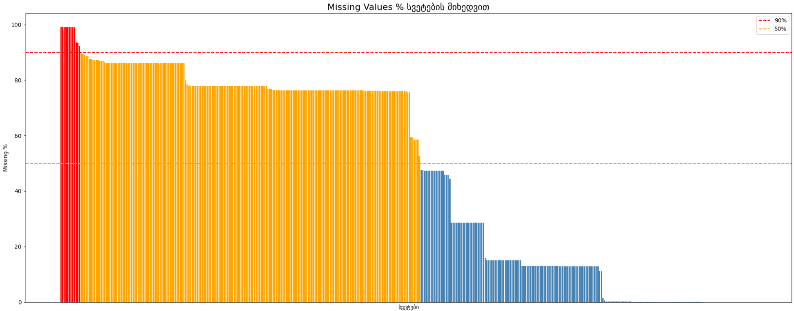
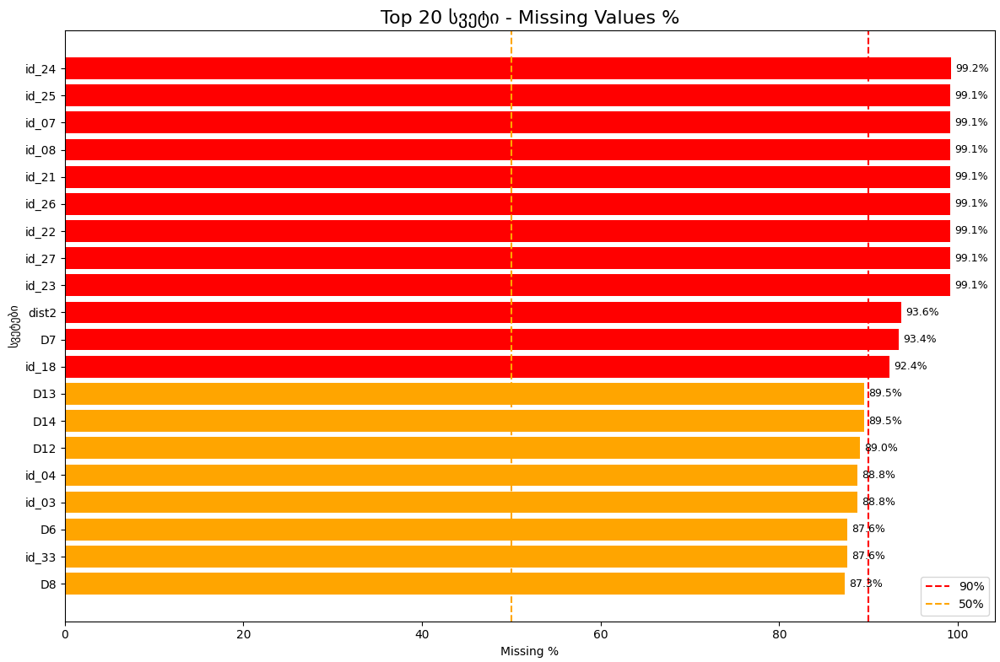
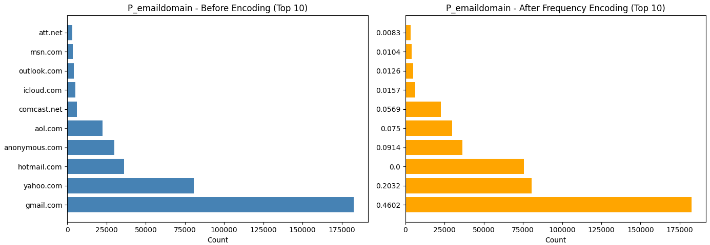
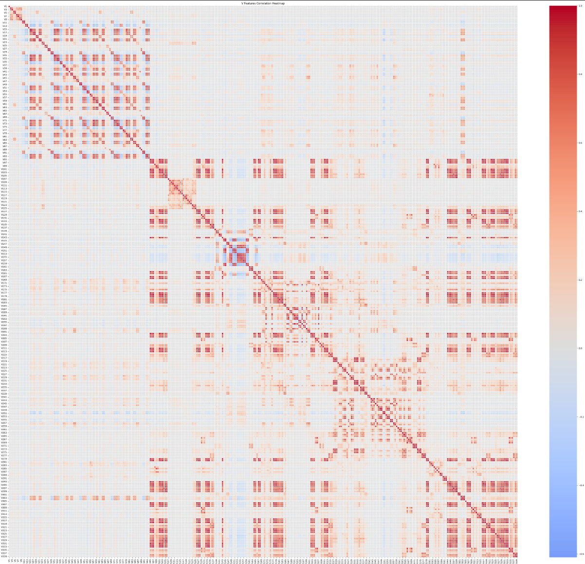
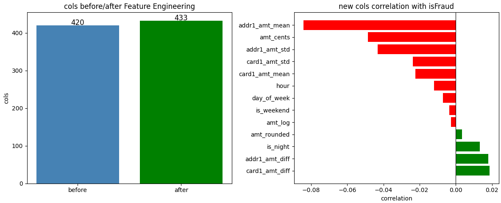
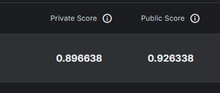

# MachineLearning---IEEE-CIS-Fraud-Detection
------
------
------
## Kaggle კონკურსის მიმოხილვა

პროექტის მიზანია ტრანზაქციების მონაცემებზე დაყრდნობით თაღლითური ქმედებების აღმოჩენა.

## 📂 რეპოზიტორიის სტრუქტურა

```bash
ML-assignment-1
 ┃
 ┣━ assets            
      ┗━ png files
 ┣━ model_experiment_XGBoost.ipynb         ---> model:XGBoost , Feature Engineering, Selection.
 ┣━ model_experiment_decisionTree.ipynb        ---> model:Decision Tree
 ┣━ model_experiment_linearRegression.ipynb              ---> model:Logistic Regression
 ┣━ model_experiment_lightgbm.ipynb            ---> model:lightGBM
 ┣━ preporcessing.py                 ---> for classes
 ┣━ model_inference.ipynb                  ---> საუკეთესო მოდელი
 ┗━ README.md
 ```

## Feature Engineering

პირველ რიგში მეხსიერების ოპტიმიზაციისთვის გამოვიყენე ფუნქცია, რომელმაც შეამცირა int64 -> int16 და float64 -> float32-მდე, რამაც დაზოგა RAM-ის დაახლოებით 50%.

როგორც გრაფიკულად ვნახე ცხრილში არსებობდა ისეთი სვეტებიც რომელთა Missing Value აჭარბებდა 90%-ს :



ამ მონაცემებეზე დაყრდნობით ავარჩიე საუკეთესო ვარიანტი და წავშალე ისეთი სვეტები რომელთა 90%+ Missing Value იყო.



ამის შემდეგ დავიწყე კატეგორიული სვეტების პრობლემის მოგვარება და გამოვიყენე Frequency Encoder რომელიც იდეალურად მუშაობს XGBoost და LightGBM - სთვის.



Frequency Encoding ის უპირატესობა ისაა რომ არ იქმნება კიდევ ახალი სვეტები ისედაც დიდი დატას პირობებში.

რაც შეეხება NaN მნიშვნელობების დამუშავებას , გამოვიყენე ორი მიდგომა 

1. Constant Fill (-999) ხეზე დაფუძნებული მოდელებისთვის - ეს მოდელს ეხმარება გამოყოს გამოტოვებული მნიშვნელობები, როგორც ცალკე ინფორმაციული ნაკადი, ნაცვლად მათი გასაშუალოებისა.
2. Median Imputation - სხვა მოდელებისთვის გამოვიყენე მედიანით შევსება, რათა მინიმუმამდე დამეყვანა outlierების გავლენა.


## Feature Selection

ვინაიდან მონაცემებში მქონდა ძალიან ბევრი V ტიპის ინფორმაცია გადავწყვიტე მხოლოდ მათზე გამეკეთებინა კონცენტრაცია (დანარჩენი ისედაც ცოტა იყო და გადავწყვიტე დამეტოვებინა , თანაც გარკვეული კორელაცია ჰქონდათ შედეგთან)



გრაფიკიდან გამომდინარე V სვეტების უმეტესობა ერთმანეთთან მაღალ კორელაციაში იყო,რაც მოდელისთვის ზედმეტ ინფორმაციას წარმოადგენდა და ამძიმებდა.
გადავწყვიტე წამეშალა წყვილიდან ერთ-ერთი რომელთა შორის კორელაციაც 0.92ზე მეტი იყო. ეს რიცხვი შევარჩიე ექსპერიმენტებით. 0.90სა და 0.95 ს შორის ავიღე საშუალო ვარიანტი 0.92

### ახალი სვეტების შექმნა

TimeFeatureExtractor - TransactionDTს დახმარებით გამოვყავი hour და day_of_week ,რაც მოდელს საშუალებას მისცემს დააფიქსიროს დროითი პატერნები, მაგალითად როგორც წესი ღამის საათებში იზრდება თაღლითური შეტევების რაოდენობა.
დროის ინდიკატორებით შესაძლოა მოდელს რაიმე ესწავლა თაღლითობის უკეთ გასარჩევად.


TransactionAmtTransformer - გამოვიყენე ლოგ. რათა შემემცირებინა გრძელი მონაცემები


GroupAggregator - გამოვიყენე card და addr სვეტების კომბინაცია "ვირტუალური მომხმარებლების" შესაქმნელად.  შევქმენი amt_diff ,რისი მთავარი ლოგიკაც იყო შემდეგი - თუ მომხმარებლის ისტორიული საშუალო ტრანზაქცია არის 20$, ხოლო მიმდინარე ტრანზაქციაა 500$, amt_diff მკვეთრად იზრდება. ეს მოდელს აძლევს პირდაპირ მინიშნებას, რომ თაღლითობასთან შესაძლოა გვქონდეს საქმე.

როგორც გრაფიკზე ვნახე, ჩემს მიერ დამატებულმა 12 მა სვეტმა გარკვეული გავლენა იქონია შედეგზე და ისინი კორელაციაში იყვნენ პასუხთან - მაღალი გავლენა ჰქონდათ amt_diff-ს და hour-ს, რაც ადასტურებს ჰიპოთეზას, რომ ტრანზაქციის დრო და მისი გადახრა მომხმარებლის ჩვეული ქცევისგან თაღლითობის პირდაპირი ინდიკატორებია.




## Training

### XGBoost

xgboost მოდელისთვის ჩავატარე 4 სხვადასხვა ექსპერიმენტი:
1.BaseLine - გამოვიყენე მედიანა ნანების შესავსებად და წავშალე მხოლოდ ის სვეტები, რომლებიც 90%-ზე მეტად ცარიელი იყო.
შედეგი - მოდელმა აჩვენა კარგი შედეგი, თუმცა მედიანით შევსებამ შესაძლოა გარკვეულწილად გაასაშუალოა თაღლითური ქცევის ინდიკატორები.

2. Categorical Missings(-999) აქ გამოვიყენე Constant Fill (-999). ვინაიდან XGBoost ხეებზე დაფუძნებული ალგორითმია, ამ მეთოდმა მოდელს საშუალება მისცა, გამოტოვებული მნიშვნელობები აღექვა როგორც ცალკეული, ინფორმაციული კატეგორია.
შედეგი - ამ სტრატეგიამ გააუმჯობესა მოდელი და ოდნავ უფრო კარგი შედეგი მომცა ტრენინგზე

3. Aggresive Filtering(Threshold 0.8) - ამ ექსპერიმენტში გავამკაცრე ფილტრაცია და წავშალე ყველა სვეტი, რომელსაც 80%-ზე მეტი Missing Value ჰქონდა.
შედეგი - მეორესთან შედარებით ოდნავ უფრო ცუდი შედეგი მომცა.

4. დავაწესე მაღალი შეზღუდვა კორელაციის threshold 0.95 

საბოლოოდ XGBoost ში საუკეთესო შედეგი მეორე ვარიანტმა მომცა სადაც -999 ით ჩანაცვლება გამოვიყენე. ფაქტობრივად არცერთ ექსპერიმენტში არ გვქონდა ოვერფიტინგ/ანდერფიტინგი რადგან სხვაობა ვალიდაციასა და ტრეინს შორის
სქორზე მინიმალური იყო.

### Decision Tree

ვცადე 3 სხვადასხვა ექსპერიმენტი.

1. ხის სიმაღლედ დავაწესე 2
2. სიმაღლე არ შევზღუდე
3. max_depth ახლა 15 გავხადე

ანუ პარამეტრების ცვლილებებმა სხვადასხვა შედეგები მომცა, როცა სიმაღლე არ შევუზღუდე ტრეინის შედეგი კარგი იყო , მაგრამ ვალიდაცია საგრძნობლად დაეცა - 0.022 , რაც ოვერფიტინგის მანიშნებელია.
საუკეთესო შედეგი(0.85) მაინც აჩვენა ექსპერიმენტმა სადაც მაქსიმალური სიმაღლე 15 იყო. 

### LightGBM

1. სტანდარტული მოდელი n_estimators=300, learning_rate=0.05
   ამ მოდელმა უკვე აჯობა წინა მოდელებისა და ექსპერიმენტების უმეტესობას, ტრეინსა და ვალიდაციას შორის სხვაობა იყო მინიმალური  0.940 - 0.0.928 = 0.012
2. აქ გამოვიყენე სტრატეგია minus999 , რაც როგორც ვახსენეთ იდეალურია xgboost,lightgbm სთვის და მომცა საუკეთესო შედეგი.

Val ROC-AUC: 0.9414 

Train ROC-AUC: 0.9563

CV AUC Mean: 0.9365
 

### Logistic Regression

ასევე ვცადე ლოჯისტიკ რეგრესიის რამდენიმე ვარიანტიც , რომელმაც საკამოდ სოლიდურიო შედეგი დადო.

1. პირველ ექსპერიმენტზე ვცადე მოდელი l2 რეგულარიზაციით რამაც ტრეინის შედეგი მომცა 0.86,ხოლო ვალიდაციის 0.856. სხვაობა ძალიან მინიმალურია რაც იდეალურია.
თუმცა logistic regression ის მინუსის დანახვაში დამეხმარა f1 მეტრიკა ,რომელიც საკმაოდ დაბალი იყო. იგი მიუთითებს რომ მოდელსუჭირს ბალანსის პოვნა Precision სა და recalls შორის.

2. აქ გამოვიყენე class_weight='balanced' რითაც recall საკმაოდ გაუმჯობესდა - ბალანსირებამ აიძულა მოდელი, რომ თაღლითური შემთხვევები უფრო პრიორიტეტულად აღექვა
 და შედეგად დაიჭირა მათი 73%

რეგულარიზაციამ და ბალანსმა მცირედით გააუმჯობესა AUC -ის შედეგიც

საბოლოოდ ლოჯისტიკური რეგრესია მაინც წრფივად ფიქრობს და ამ competition სთვის საჭიროა უფრო ძლიერი მოდელი.

## MLFlow Tracking

მლფლოუზე შევეცადე დამელოგა თითქმის ყველა ექსპერიმენტი რაც ჩავატარე. შევქმენი სხვადასხვა მოდელებისთვის ცალ-ცალკე 'ფაილი' , რამაც ბევრად თვალსაჩინო
გახადა ექსპერიმენტები.

dagshub ლინკი:  https://dagshub.com/ndoda23/MachineLearning---IEEE-CIS-Fraud-Detection

ექსპერიმენტების ლინკი: https://dagshub.com/ndoda23/MachineLearning---IEEE-CIS-Fraud-Detection.mlflow/#/experiments

## გამოყენებული მეტრიკები 

1. გამოვიყენე ROC-AUC - ეს არის ჩვენი მთავარი მეტრიკა რითაც საბოლოო სქორს ვიღებთ. ის ზომავს მოდელის უნარს, განასხვავოს ერთმანეთისგან კლასები (თაღლითი vs პატიოსანი მომხმარებელი).

2. Recall - პასუხობს კითხვას თუ არსებული თაღლითობებიდან რამდენი დაიჭირა მოდელმა.

3. F1-Score - გვიჩვენებს ბალანსს. თუ Recall მაღალია, მაგრამ F1 დაბალი (Logistic Regressionში როგორც მოხდა), ეს ნიშნავს, რომ მოდელი ბევრ ცრუ განგაშს იძლევა.


## საბოლოო შედეგი 

საბოლოო შედეგად მაინც ავარჩიე LightGBM რომელმაც ოდნავ უფრო უკეთესი შედეგი მომცა ვიდრე XGBoost, მეორე ადგილზე უდაოდ XGBoost გავიდა.



